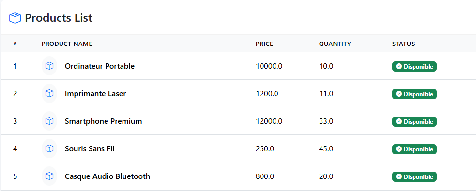
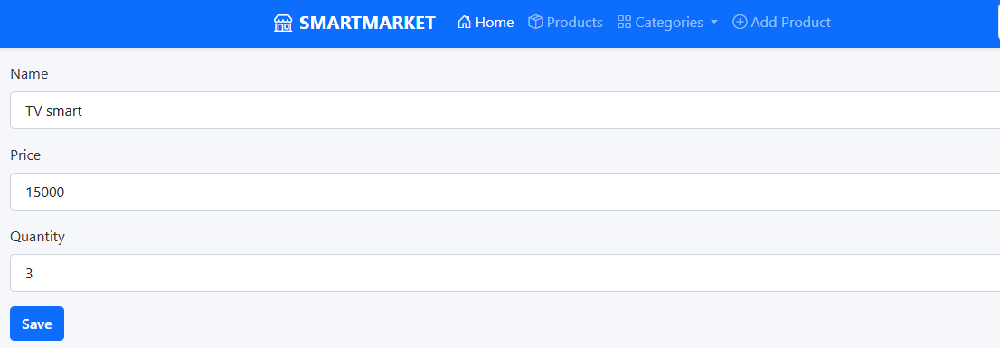
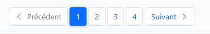
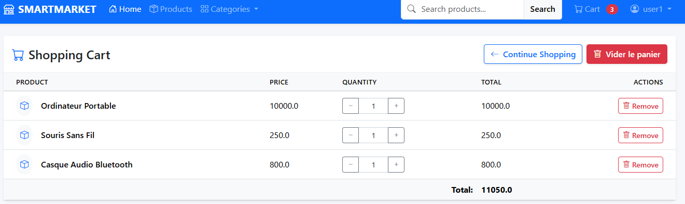
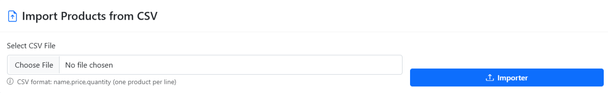
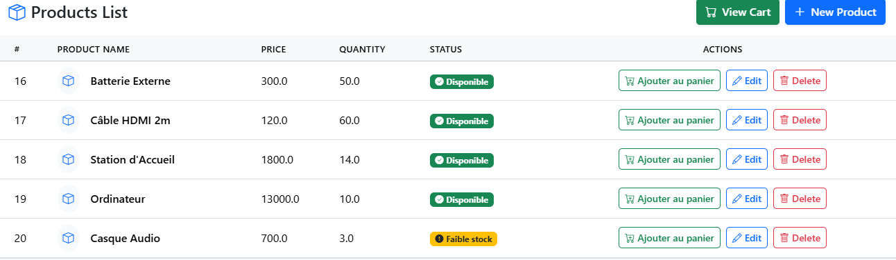
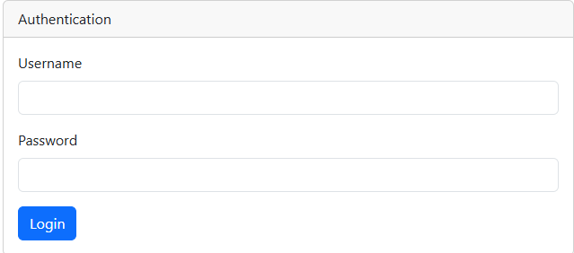

# 🛍️ Application Web de Gestion de Produits – Spring Boot All In One

Cette application Web JEE basée sur **Spring Boot**, **Spring Data JPA**, **Spring MVC** ,**Thymeleaf** et **Spring Security** permet de gérer une liste de produits (CRUD) avec des fonctionnalités avancées comme pagination, import CSV, panier simulé, et statut visuel des stocks.

---

## 🎯 Objectifs

Créer une application web qui permet :

- La gestion des produits (ajout, suppression, édition, recherche)
- La validation des formulaires
- La sécurité avec Spring Security (rôles ADMIN / USER)
- L’affichage ergonomique avec Thymeleaf + Bootstrap

---

## ✅ Étapes réalisées

### 1. Création du projet Spring Boot avec les dépendances

📦 Dépendances ajoutées :

- `Spring Web`
- `Spring Data JPA`
- `H2 Database` + `MySQL Driver`
- `Thymeleaf`
- `Lombok`
- `Spring Security`
- `Spring Validation`

### 2. Conception de l'entité "Product"

- Modélisation des attributs d’un produit (nom, prix, quantité, etc.)

### 4. Test de la couche DAO

- Vérification du bon fonctionnement via H2 console.

### 5. Désactivation de la sécurité par défaut

- Pour permettre un développement rapide en phase initiale.
### 6. Création de l'interface utilisateur

- Liste des produits
- Ajout et suppression de produit
- Modification des produits
- Layout général avec en-tête, pied de page et navigation
- Validation de formulaire

### 7. Sécurisation de l'application

- Authentification avec utilisateurs et rôles
- Restriction des actions critiques aux utilisateurs de type ADMIN

---
## 🧩 Fonctionnalités supplémentaires

### 📄 Pagination

- La liste des produits est paginée pour améliorer l’ergonomie

### 🔍 Recherche de produits

- Filtrage dynamique par nom de produit

### 🛒 Panier de commande (simulation)

- Ajout de produits à un panier temporaire
- Accessible à tous les utilisateurs

### 📋 Import de produits via fichier CSV

- Upload d’un fichier CSV pour insérer plusieurs produits
- Réservé aux utilisateurs ADMIN
- Traitement avec une bibliothèque d'importation

### 🟢 Statut visuel du stock

- Affichage visuel du statut d’un produit selon la quantité :
    - Disponible (stock suffisant)
    - Faible stock (moins de 5)
    - Rupture (zéro)
## 📸 Captures d’écran recommandées

| Fonction                       | Capture suggérée                     |
|-------------------------------|--------------------------------------|
| Liste des produits            |     |
| Formulaire d’ajout            |  |
| Pagination                    |   |
| Panier                        |       |
| Importation de CSV            |       |
| Affichage des statuts stock   |       |
| Interface sécurisée (login)   |        |